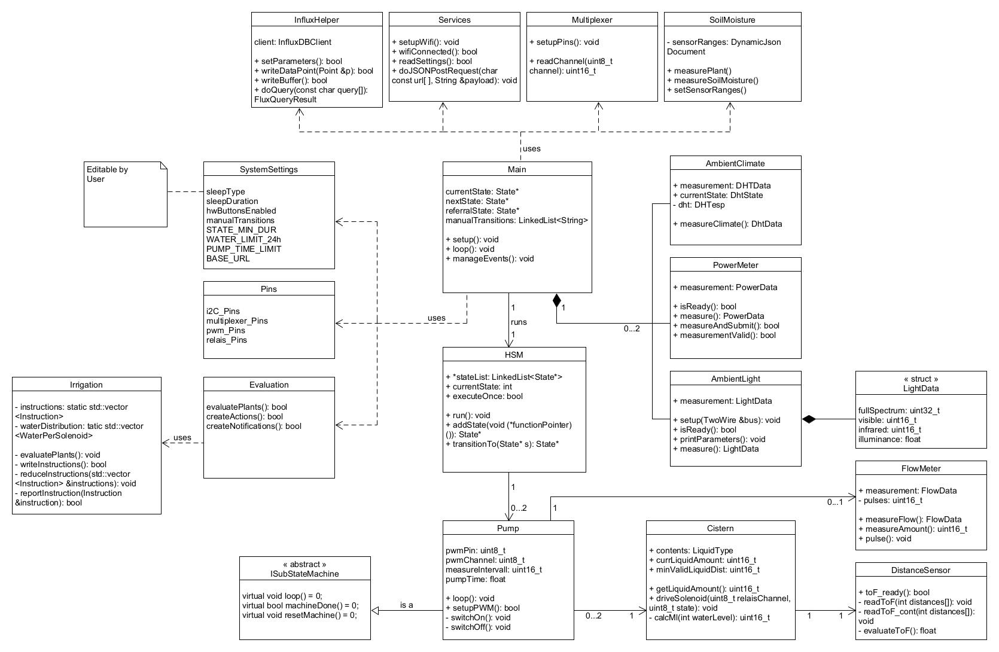
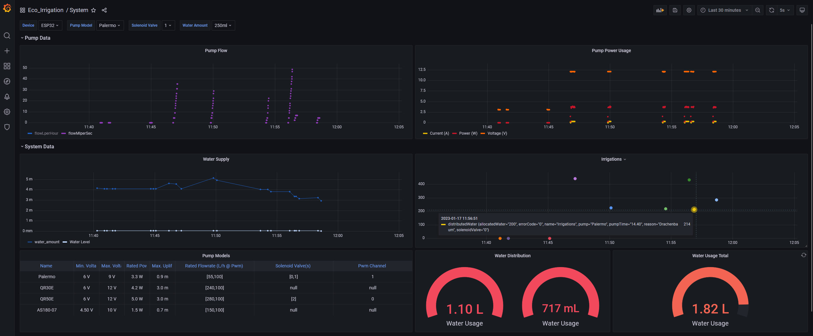
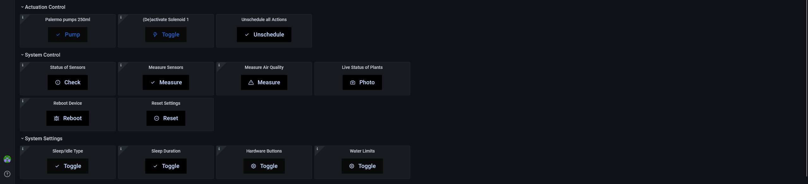
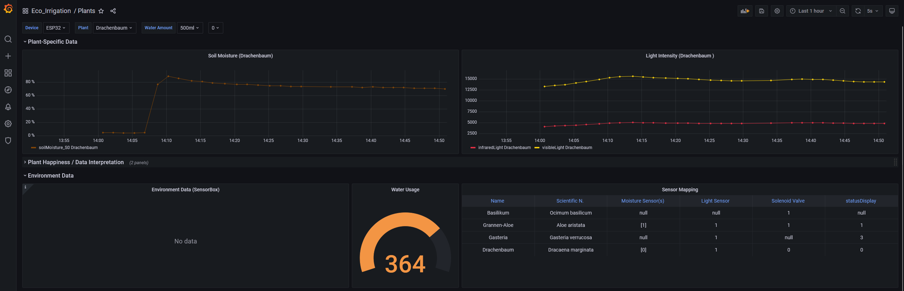
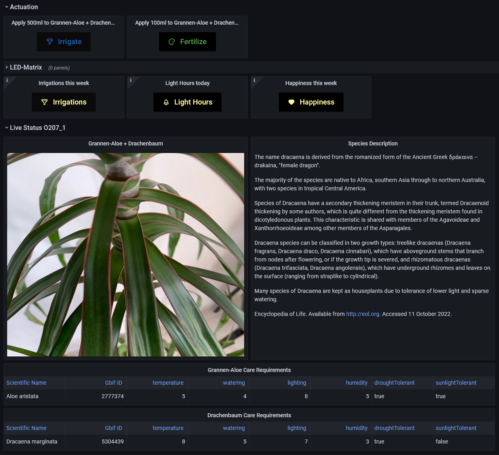
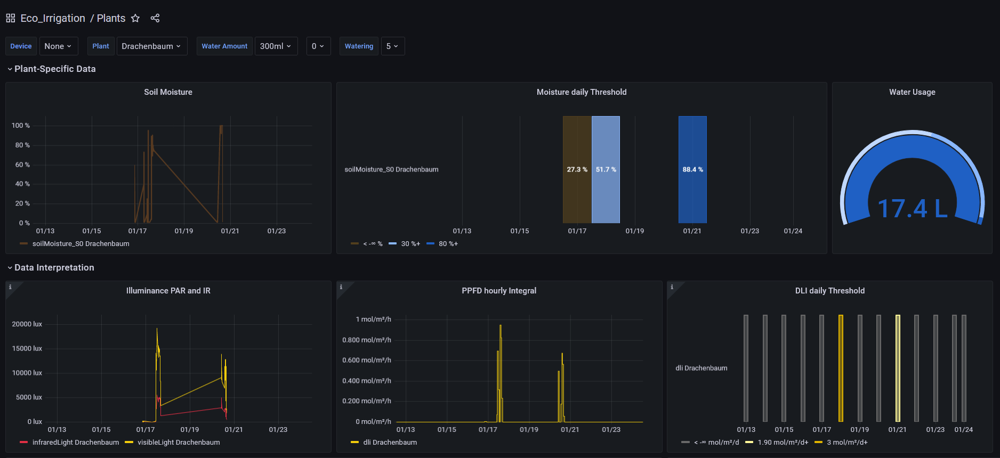
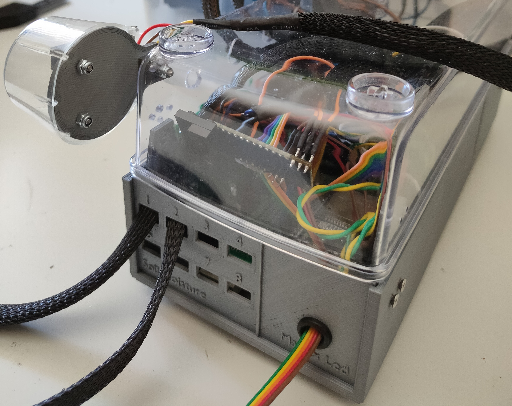
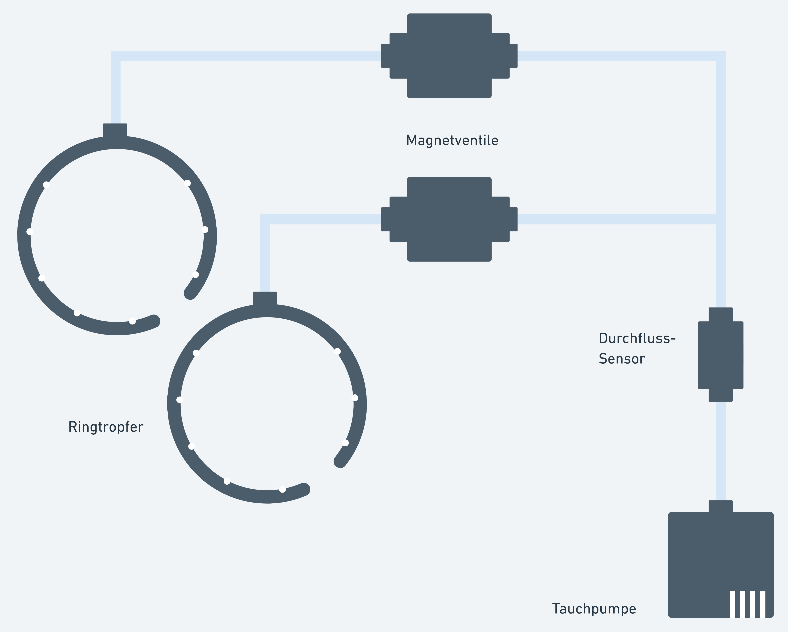
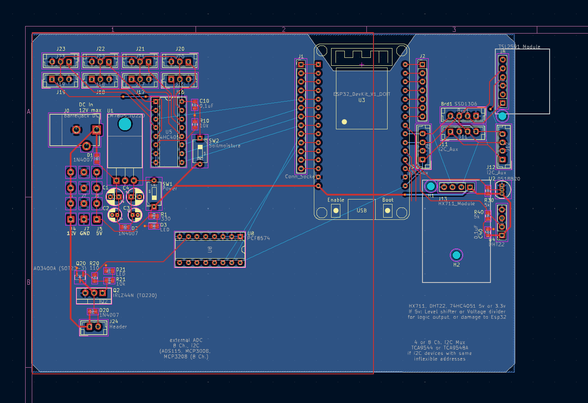

# Automated plants care system for phytoremediation & indoor climate management

An IoT system that monitors indoor air quality, tracks plant conditions, and automates irrigation.
This project aims to find a scalable approach to effectively enhance indoor air quality in offices and residential spaces.
A thorough literature review was conducted to identify plant species that are particularly effective at filtering VOC gases and formaldehyde, while requiring minimal resources and being well-suited for indoor environments.

This project was developed as a **Bachelor's thesis** in Computer Science at the University of Applied Sciences Trier.
Inspired by projects like Kyle Gabriel's [Automated Hydroponic System](https://kylegabriel.com/projects/2020/06/automated-hydroponic-system-build.html) and MIT Media Lab's [Personal Food Computer](https://www.media.mit.edu/projects/personal-food-computer/overview/).

## What It Does

The system connects up to **8 plants**, monitors their environment in real-time, and waters them automatically based on configurable schedules and sensor readings.
Multiple system units can be connected to the same master server.
Monitored parameters include soil moisture, light spectrum and intensity, water flow, and water reservoir levels.

The current state of each plant is displayed on a physical dot matrix display attached to each individual plant.
Events like irrigations or measurements are documented, persisted, and displayed in the dashboard.
Each plant has a dedicated dashboard where the user can view its requirements, read a species description (via the [Encyclopedia of Life API](https://eol.org/docs/what-is-eol/data-services)), and trigger manual actions like irrigations or display its current happiness.

## Tech Stack

| Layer | Technologies |
|-------|-------------|
| Frontend | Grafana |
| Backend | Node.js, Express, REST API |
| Data | InfluxDB, MongoDB |
| Firmware | C++, Arduino, ESP32 |
| Protocols | HTTPS, I2C, ESP-NOW |

## System Architecture

System behavior is modeled as a **hierarchical state machine** with several sub-state machines that control complex tasks.
This enables coordinated execution of multi-part measurements and chained actions. For example, an irrigation event involves measuring and calculating available water, checking safety limits, switching solenoid valves, and activating pumps to ensure a safe irrigation cycle.

The main system operates through distinct states where tasks like connecting, sensor initialization, measurement, and data evaluation are processed sequentially.
The ESP32's dual-core architecture is ideal for this design, dedicating one core to running the main state machine while the other remains available for tasks like communicating with external systems.

### Backend & Data Flow

Sensor data is collected periodically by the prototype and sent to InfluxDB for time-series storage. 
A Node.js and Express backend aggregates this data and serves it through a RESTful API.
MongoDB is used for persistent storage of system configuration, sensor mappings, and plant data.

Plants can be organized individually or into plant groups for collective management.
Dashboard actions such as triggering irrigations or measurements work by sending POST requests to REST endpoints that are mapped to specific plants or plant groups.
Plant groups can be reorganized without restarting the system.

## Dashboard for System Monitoring & Control

System control and monitoring of sensor data is implemented via Grafana dashboards.
A system-specific dashboard allows monitoring of trends such as indoor climate and water usage over time.

Administrators can review current sensor mappings and system details like power consumption or failed irrigation events.
Maintenance actions such as checking sensor status, triggering irrigations, measurements, or system restarts can be performed directly from the dashboard.
Sensor mappings and safety limits (e.g., water usage, time between irrigations) can be reassigned on the fly without requiring a system restart.

## Dashboard for individual Plants

Aggregated sensor readings of each individual plant (or plant group) are displayed on decicated per-Plant dashboards.
It shows plant-specific sensor readings like moisture and light exposure.
Relevant metrics like overall happiness or number of irrigations can be displayed on the DOT-Matrix Display that is physically attached on each plant.
Additional Information about the species is pulled from a specialised API and displayed next to the live-status of the plant.

   

Actuating the "Irrigate" or "Fertilize" buttons causes the system to check which pumps and solenoids are currently assigned to this plant. 
It then checks which other plants are connected and hence affected by the action. Also the current water or fertilizer level is measured and calculated.
If all requirements are met, an irrigation is scheduled, which is executed as a controlled sub-statemachine process.

   

The light sensor measures visible light intensity at hourly intervals, covering the wavelength range relevant for photosynthetically active radiation (PAR). 
The measured illuminance is converted to Photosynthetic Photon Flux Density (PPFD), which represents the number of photons reaching a surface per second. 
From this, the Daily Light Integral (DLI) is calculated to determine the total light a plant receives per day. 
A server-side InfluxDB task evaluates the weekly average DLI against species-specific thresholds to assess whether light conditions are sufficient. 
The results are displayed in the plant dashboard as an hourly PPFD graph and a DLI status history panel, with dynamic thresholds pulled from the plant's requirements stored in MongoDB.

### Hardware

The prototype is built around an **ESP32** microcontroller with the following components:

| Component | Purpose |
|-----------|---------|
| Esp32 and Esp32 Cam | Logical and visual control |
| DHT 22 | Temperature and moisture |
| MH-Z19B Infrared | CO2-concentration |
| AMS-Osram TSL2591 | Light spectrum and intensity |
| EN0193 Capacitive v1.2 | Soil moisture |
| VL53L0X (ToF sensor) | Water reservoir level |
| CD74HC4067 (Multiplexer) | Scaling analog sensor inputs |
| INA219 | Current/power monitoring |
| MAX7219 Dot matrix | Per-plant status display |
| Solenoid valves | Distributing and securing irrigations |

Several types of pumps, reservoirs, and 3D-printed water distributors were tested to evaluate different irrigation methods, including drip, subsurface, and root irrigation. 
The goal was to optimize resource usage so the prototype can operate autonomously for up to two weeks without intervention.

<!--  -->

### Water Distribution

For water distribution at the plant level, a drip irrigation system with a ring-shaped distributor was used, based on based on [Plant Watering Rings](https://www.thingiverse.com/thing:4461214).
Pretty amazing that this design can evenly and efficiently water medium to tall plants while using only 15 grams of filament to print — roughly 10 cents per unit. 
Tests were also conducted combining this with root irrigation, which further saves water, prevents moss growth on the soil surface, and is also more efficient for applying liquid fertilizer.

Solenoid valves were initially used for water distribution, but they added significantly to cost, weight, and minimum required water pressure, so they were dropped in version 2.0.
Lightweight, multi-way, low-voltage solenoid valves designed for this use case do exist, but they are sometimes difficult to source reliably from Chinese suppliers. 
The tubing used is food-grade silicone, chosen for its flexibility, tight bending radius, and absence of chemical odor.

## Revision 2.0 and PCB-Design

Completion of the first prototype led to the development of an improved, scalable version 2.0. 
The first step was to analyze the conceptual and technical shortcomings of the original design and redefine requirements for a system that could realistically be deployed at scale in offices and homes. 
The new approach was to reduce the per-device plant support to four, while shifting focus toward connecting multiple smaller system units to a central master server.
Reducing the power-envelope and scale allowed allowed for a significantly smaller device footprint, simpler assembly, and easier repair.

A lower-power pump was selected, and the water reservoir was downsized to be interchangeable and recyclable — improving portability, hygiene, and reducing maintenance effort. 
Based on these revised requirements, a new set of electrical components was chosen with a focus on flexibility, cost-efficiency, and interchangeability. 
Finally, a PCB was designed in KiCad to integrate these components into a compact, production-ready layout.

## Research

Beyond constructing the prototype, a key focus of this project was researching the current state of phytoremediation.
Existing green wall systems and irrigation methods were examined, along with the effects of indoor climate on workplace productivity.
Common indoor pollutants such as VOCs and formaldehyde were identified, along with suitable sensors to measure them.
A literature review was conducted to select a variety of plant species that are the most efficient at filtering a particular category of air pullutant.
Requirements were to identify two to three species per pollutant that thrive under minimal resources and in indoor environments.

## License

MIT License — see [LICENSE](LICENSE) for details. If you have questions or need advice for a similar project, feel free to reach out.

---

*Built by [Julian Heller](https://github.com/julizs)*
